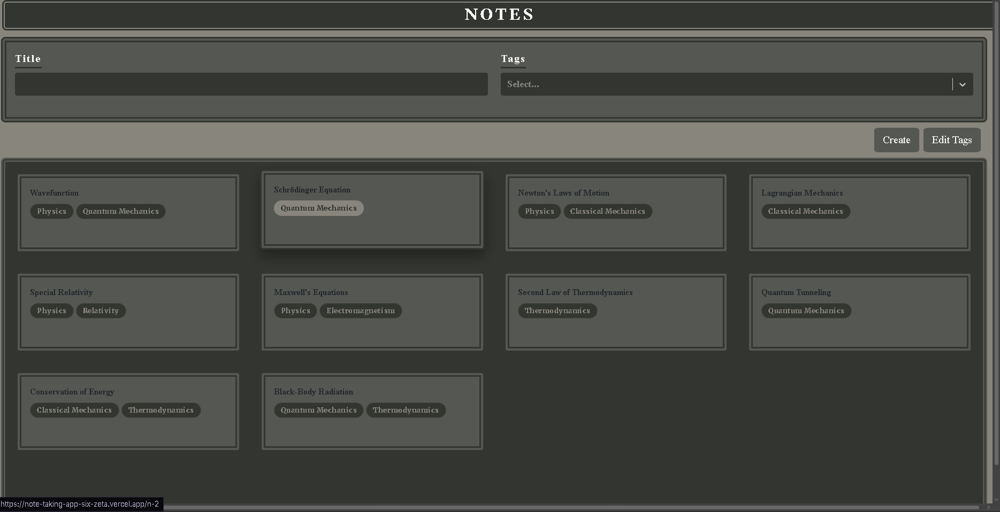
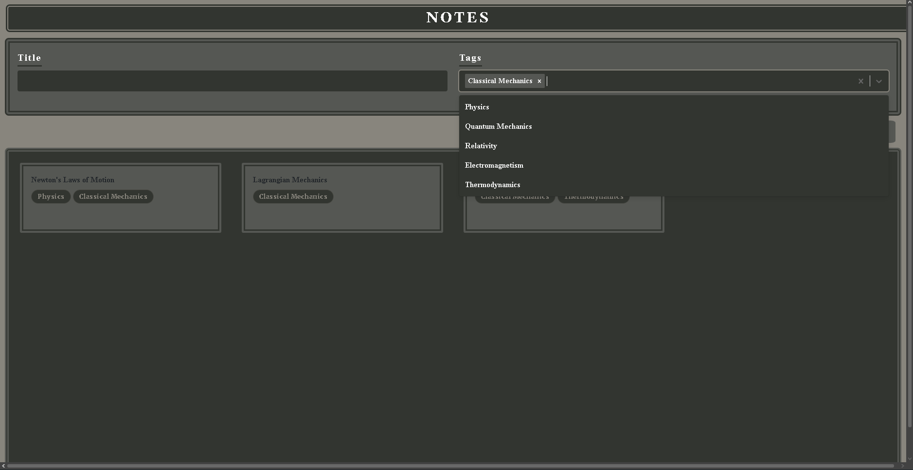
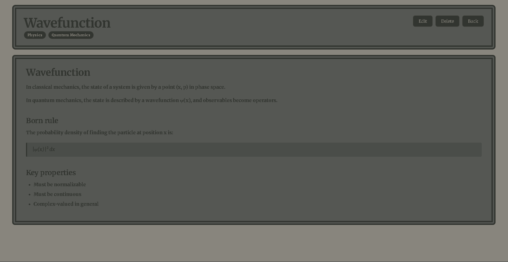

# Note-Taking App

A  stylised markdown note-taking app with tag-based organization and search - local-storage. 

**Live demo:** https://note-taking-app-six-zeta.vercel.app



## Features

- Write notes in **Markdown** with live-rendered output
- Tag notes with reusable, user-defined tags
- Filter notes by **title** and **multiple tags** at once
- Inline **tag management** (rename, delete) via modal
- Edit and delete existing notes
- **localStorage** persistence — your notes stay on refresh
- Responsive grid layout across mobile, tablet, and desktop

## Screenshots

### Filter by tag
Filter the grid down to a subset of notes by selecting one or more tags.



### Rendered note view
Open any note to read its rendered markdown — headings, blockquotes, lists, and inline emphasis are all styled.



## Tech stack

React 19, TypeScript, Vite. 

## Getting started

Prerequisites: Node.js 18+ and npm.

```bash
git clone https://github.com/mi-xzs/Note-Taking-App.git
cd Note-Taking-App
npm install
npm run dev
```

Open the URL printed by Vite (usually `http://localhost:5173`).

## Scripts

| Command           | What it does                              |
| ----------------- | ----------------------------------------- |
| `npm run dev`     | Start the Vite dev server with HMR        |
| `npm run build`   | Type-check and produce a production build |
| `npm run preview` | Serve the production build locally        |
| `npm run lint`    | Run ESLint over the project               |

## Project structure

```
src/
  App.tsx              Top-level routes and note/tag state
  main.tsx             Vite entry point
  NoteList.tsx         Home view: search, filter, grid of notes
  NoteForm.tsx         Shared form used by New/Edit
  NewNote.tsx          Create-note route
  EditNote.tsx         Edit-note route
  NoteLayout.tsx       Route layout that resolves :id -> Note
  Note.tsx             Single-note view with rendered markdown
  useLocalStorage.ts   Typed localStorage hook
```
